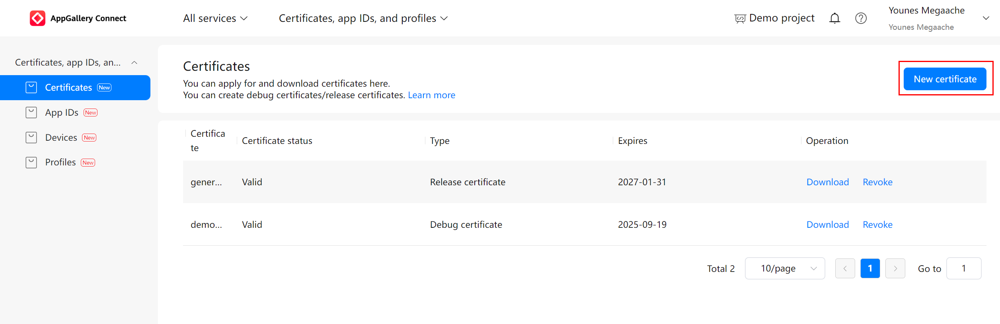

# HarmonyOS Signing Configuration Guide

This guide will walk you through the process of configuring the signing config for HarmonyOS apps, including steps for creating a keystore and CSR, configuring your app in the Huawei AppGallery Connect console, adding a test device, and setting up a P7B profile.

This guide will focus on debug signing configuration, but the same steps should apply for generating release singing config.

## Table of Contents

- [HarmonyOS Signing Configuration Guide](#harmonyos-signing-configuration-guide)
  - [Table of Contents](#table-of-contents)
  - [Introduction](#introduction)
  - [Requirements](#requirements)
  - [1. Generating a Keystore](#1-generating-a-keystore)
  - [2. Generate a certificate](#2-generate-a-certificate)
  - [3. Registering App ID](#3-registering-app-id)
  - [4. Adding Test Device’s UDID](#4-adding-test-devices-udid)
    - [Finding your Device's UDID](#finding-your-devices-udid)
    - [Registering the UDID in AppGallery console](#registering-the-udid-in-appgallery-console)
  - [5. Creating and Downloading the P7B Profile](#5-creating-and-downloading-the-p7b-profile)
  - [Add signature configuration](#add-signature-configuration)
  - [Additional Resources](#additional-resources)
  - [Conclusion](#conclusion)

---

## Introduction

To run HarmonyOS apps on physical devices or for production deployment, your app must be signed with a valid Huawei certificate. This guide covers the configuration of the signing environment and the creation of necessary files such as the .p12 keystore, .CSR file, .cer certificate, and .p7b profile.

---

## Requirements

Before proceeding, ensure that your have these requirements :

- **DevEco Studio**: Required for generating keystore and CSR.
- **Huawei Developer Account**: Sign up at [Huawei Developer Console](https://developer.huawei.com/consumer/en/).
- **HarmonyOS device**: To register it as test device.

---

## 1. Generating a Keystore

Show details

First, you need to generate a .p12 keystore. Follow these steps to create one:

1. open DevEco Studio
2. Go to `Build` > `Generate Key and CSR`.  
   

3. create `new` to create new keystore (or `choose existing` to choose an existing one and skip next step)

   

4. Select where to save the keystore and add set keystore password
   

5. back into the previous screen, create new key by adding `alias` and `key passwor`

6. click `Next`, choose where to save the `.csr` file that will be generated then click Finish
   

After the above steps, you should now have `.p12` and `.csr` files, next steps will be done on AppGallery console

## 2. Generate a certificate

show details

Next, you need to upload the CSR file to Huawei AppGallery and download a `.cer` certificate.

1. Log in to the [Huawei Developer Console](https://developer.huawei.com/consumer/en/).
2. Navigate to `AppGallery Connect` > `Certificates, app IDs, and profiles` .
   

3. Go to `Certificates` and click `New Certificate`  
   

4. add a `name`, select `debug` for `certificate type`, and click `Select` to upload the `.csr` file generate in the first step.  
   

5. Submit the CSR and wait for the signing certificate to be generated.
6. Click `download` to download `.cer` file  
   
7. After completing above steps, you should now have `.p12`, `.csr` and `.cer` files, its recommended to keep all of them in one folder

## 3. Registering App ID

 

show details

Lets your harmonyOS app in AppGallery Connect:

1. In the same page, click `App Ids` in the side navigation Panel  
   
2. Enter your `app name`, `app package name` and select `App` for `Level-1 app category`

   > if you've already created a project in DevEco IDE, you can find the package name at `entery/src/main/config.json`#`app.bundleName`

      

3. Click `Next`, enter a project name or choose one from the dropdown
4. click `OK`

## 4. Adding Test Device’s UDID

<!-- 

show details
 -->

To run the app on test devices, you need to register the UDID (Unique Device Identifier) of each test device in AppGallery console.

### Finding your Device's UDID

UDID of a HarmonyOS device (phone, tablet, smartwatch..)

If the device support cable connection, the just plug it to your computer and enable `HDC debugging` from `developer options`, If device does not support cable like a smartwatch (e.g. Huawei watch 4), then follow these steps to connect it Wirelessly:

1. Create a Hotspot using your PC or Phone
2. Connect the device to the Hotspot (if its phone hotspot, then connect your laptop to it too)
3. Enable developers options on the smartwatch, by going to `settings` app > `About` > then tap `Harmony OS` version multiple times
4. Navigate back to home menu of `Settings` app then go to `developer options`, scroll down and enable `HDC debugging`, then enable `Debug via WLAN` which should display an IP address and port  
   
5. connect to the watch using HDC cli tool and the address shown above (you can find it in HarmonyOS SDK folder)  
   `hdc tconn <ip>:<port>`
6. once the watch is connected, run the command: `hdc shell bm get --udid` which should print the UDID
   
7. copy the UDID and move to the next step

UDID of a Lite HarmonyOS device (sportswatch..)

For Lite devices like sportswatch (e.g. Huawei GT4), please follow these steps:

1. download and install Huawei Health app on your phone through AppGallery store or download the APK from trusted source
   > if you have non Huawei device, then you should install Huawei AppGallery and HMS Core to avoid headaches while pairing your watch or when testing other services like WearEngine SDK: https://consumer.huawei.com/ae-en/mobileservices/appgallery/installation/
2. Open Huawei Health and follow the steps in Huawei Health app to pair the sportwatch
3. Download and install DevEco Studio Assistant app on your phone through AppGallery
   > if you can't find it in AppGallery then download this version [DevEco Assistant v1.1.3.641.apk](HUAWEIDevEcoAssistant_v1.1.3.641.apk)
4. open DevEco Assistant and click connect, you should be able to see the name and UDID of you lite device
   
5. copy the UDID to your PC and move to the next step

### Registering the UDID in AppGallery console

Show details

After finding your device UDID, go back to Huawei Developer console and follow these steps:

1. navigate to `Devices` from side navbar
   
2. click on `Add device`
3. Enter a `name`, select the type of your device from the dropdown, then paste the `UDID` copied from previous step  
   
4. click `submit` and move on to the next step

## 5. Creating and Downloading the P7B Profile

To deploy the app to a test device, create and download a **P7B profile**.

1. In **AppGallery Connect**, navigate to **Build > Signing Certificate**.
2. Select **Create P7B Profile**.
   
3. Choose the certificate you uploaded in step 3.
   

   

4. Choose the test devices.
   
   

5. Click **Ok** then **Generate**.
6. After the profile is created, download the **P7B file** to save it along with other signature files
   

## Add signature configuration

1. in DevEco studio, go to **File** > **project strcture**
2. Go to **Project**, **singing configs**
3. untick (de-select) `automatically generate certificate`
4. Fill the form
   1. select the `.p12` keystore generate in **STEP 1**
   2. Enter the store password
   3. Enter the key alias name
   4. Enter the key password
   5. Select the `.p7b` profile download in **STEP 5**
   6. Select the `.cer` certificate download in **STEP 2**
5. click **OK** and wait for the IDE to sync the project

   

---

## Additional Resources

- [Signing your App/Service](https://developer.huawei.com/consumer/en/doc/harmonyos-guides-V5/ide-signing-V5)
- [Huawei AppGallery Connect Documentation](https://developer.huawei.com/consumer/en/doc/development/AppGallery-connect-Guides/agc-get-started-0000001053628149)

---

## Conclusion

You have now configured the signing environment for Huawei LiteWearable development. This process included generating a keystore, creating a CSR, configuring your app in the Huawei AppGallery Connect console, adding a test device’s UDID, and generating a P7B profile. With the signing configuration complete, you are now ready to deploy and test your app on Huawei devices. -->
